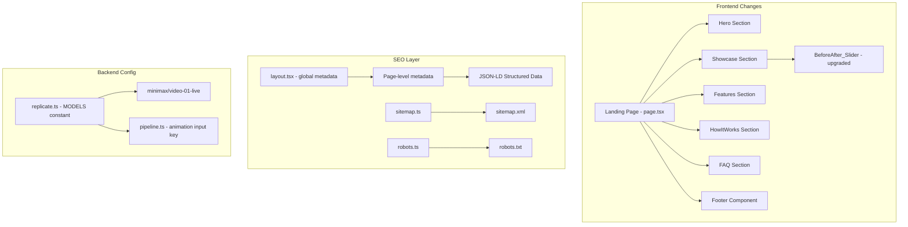

# Design Document: Landing Page & SEO Overhaul

## Overview

本设计覆盖 OldPhotoLive AI 应用的五大改造领域：

1. **视频模型升级** — 将 `stability-ai/stable-video-diffusion` 替换为 `minimax/video-01-live`（Hailuo Live），获得更好的面部表情和动作质量，同时降低成本。
2. **落地页重设计** — 将当前极简的上传页面改造为对标 palette.fm / remini.ai 的富内容落地页，包含 Hero、前后对比展示、功能亮点、使用流程、FAQ、页脚等模块。
3. **BeforeAfter_Slider 升级** — 从点击拖拽交互改为鼠标悬停自动跟随，并在滑块到达两端时智能隐藏标签。
4. **全站 SEO 优化** — 为每个页面添加元数据、结构化数据、语义化 HTML、站点地图和 robots.txt。
5. **其他页面打磨** — 优化 Pricing、History、Login、Result 页面的视觉一致性和 SEO。

## Architecture

### 整体架构

现有架构保持不变（Next.js 14 App Router + Tailwind CSS + next-intl），本次改造主要涉及前端组件和配置层：



### 设计决策

1. **落地页为单一 Server Component + Client Islands**：落地页主体使用 Server Component 以利于 SEO（HTML 直出），仅交互部分（BeforeAfter_Slider、FAQ 折叠、Upload 区域）使用 Client Component。
2. **i18n 内容全部走 messages JSON**：所有新增文案通过 `messages/en.json` 和 `messages/zh.json` 管理，不硬编码。
3. **BeforeAfter_Slider 使用 `onMouseMove` 替代 `onPointerDown + onPointerMove`**：悬停即跟随，无需点击。同时保留触摸和键盘支持。
4. **SEO 使用 Next.js 内置 Metadata API**：通过 `export const metadata` 或 `generateMetadata()` 函数定义，不使用 `<Head>` 组件。
5. **sitemap 和 robots 使用 Next.js App Router 约定**：`src/app/sitemap.ts` 和 `src/app/robots.ts` 自动生成。
6. **视频模型切换仅修改常量和参数**：`minimax/video-01-live` 使用 `image_url` 作为输入键（而非 `input_image`），参数结构不同于 SVD。

## Visual Design

### 色调方案

参考 palette.fm 和 remini.ai 的高级感设计，将现有的深蓝色调（`#0F172A`）切换为深棕/黑色调：

```css
:root {
  /* 主背景 — 深棕黑，类似 palette.fm 的暗色调 */
  --color-primary-bg: #0C0A09;
  /* 渐变起始色 — 暖金色 */
  --color-gradient-from: #D4A574;
  /* 渐变结束色 — 深金色 */
  --color-gradient-to: #B8860B;
  /* 强调色 — 柔和的琥珀色 */
  --color-accent: #E8B86D;
  /* 主文本 — 暖白 */
  --color-text-primary: #FAF5F0;
  /* 次要文本 — 暖灰 */
  --color-text-secondary: #A8A29E;
  /* 卡片/容器背景 — 微透明暖色 */
  --color-card-bg: rgba(255, 255, 255, 0.03);
  /* 边框 — 微透明暖色 */
  --color-border: rgba(255, 255, 255, 0.08);
}
```

### 设计风格

- **整体氛围**：深色奢华感，类似高端摄影工具
- **卡片样式**：微透明毛玻璃效果（`backdrop-blur`），细微边框
- **按钮**：暖金色渐变，hover 时微微发光
- **排版**：大标题使用渐变色文字，正文使用暖白/暖灰
- **间距**：宽松的 section 间距，给内容呼吸空间
- **图片展示**：圆角卡片，微妙阴影

## Components and Interfaces

### 1. BeforeAfterCompare（升级）

```typescript
// src/components/BeforeAfterCompare.tsx

export interface BeforeAfterCompareProps {
  beforeUrl: string;
  afterUrl: string;
  beforeLabel?: string;
  afterLabel?: string;
}

// 核心行为变更：
// - onMouseMove: 鼠标在组件上移动时，slider 位置 = (clientX - rect.left) / rect.width * 100
// - onMouseLeave: 保持最后位置不变
// - onTouchMove: 触摸时同样跟随
// - 标签显示逻辑：
//   position <= 0  → 只显示 Before
//   position >= 100 → 只显示 After
//   其他 → 两个都显示
// - 保留键盘 ArrowLeft/ArrowRight 支持（step=2）
// - 保留 aria-slider 无障碍属性

export function clamp(value: number, min: number, max: number): number;
export function calcPosition(clientX: number, rect: DOMRect): number;
```

### 2. Landing Page（新建/重写）

```typescript
// src/app/page.tsx — 改为 Server Component（主体）

// 结构：
// <Navbar />
// <main>
//   <HeroSection />          — Server rendered, CTA scrolls to upload
//   <ShowcaseSection />       — Contains multiple BeforeAfterCompare (Client)
//   <FeaturesSection />       — Server rendered feature cards
//   <HowItWorksSection />     — Server rendered steps
//   <UploadSection />         — Client Component (existing UploadZone)
//   <FAQSection />            — Client Component (accordion)
//   <Footer />                — Server rendered
// </main>
```

### 3. FAQ Accordion（新建）

```typescript
// 内联在 FAQSection 中，或作为独立 Client Component

interface FAQItem {
  questionKey: string;  // i18n key
  answerKey: string;    // i18n key
}

// 点击 question 切换 answer 的展开/折叠
// 使用 CSS transition 实现平滑动画
```

### 4. Footer（新建）

```typescript
// src/components/Footer.tsx — Server Component
// 包含：应用名称、简介、导航链接（Home, Pricing, History）
// 所有文案从 i18n 读取
```

### 5. SEO 相关文件

```typescript
// src/app/layout.tsx — 全局 metadata
export const metadata: Metadata = {
  title: { default: "OldPhotoLive AI", template: "%s | OldPhotoLive AI" },
  description: "...",
  openGraph: { ... },
  twitter: { card: "summary_large_image", ... },
};

// src/app/sitemap.ts
export default function sitemap(): MetadataRoute.Sitemap { ... }

// src/app/robots.ts
export default function robots(): MetadataRoute.Robots { ... }

// 各页面 — export const metadata 或 generateMetadata()
```

### 6. Video Model Config（修改）

```typescript
// src/lib/replicate.ts — 修改 MODELS.animation 和 ANIMATION_PARAMS

export const MODELS = {
  restoration: "tencentarc/gfpgan:...",
  colorization: "piddnad/ddcolor:...",
  animation: "minimax/video-01-live",  // 无需版本 hash，Replicate 自动用最新
} as const;

export const ANIMATION_PARAMS = {
  prompt: "Bring this old photo to life with natural facial expressions and subtle movement",
} as const;

// pipeline.ts 中 animation 调用改为：
// runModel("animation", { image_url: colorizedCdnUrl })
// 注意：minimax/video-01-live 使用 image_url 而非 input_image
```

## Data Models

### i18n Message Structure（新增键）

```typescript
// messages/en.json 和 messages/zh.json 新增以下顶级键：

interface LandingMessages {
  landing: {
    hero: {
      title: string;        // "Bring Your Old Photos Back to Life"
      subtitle: string;     // "AI-powered restoration, colorization..."
      cta: string;          // "Try It Free"
    };
    showcase: {
      title: string;        // "See the Magic"
      subtitle: string;     // "Hover to compare..."
      items: {
        label1: string;     // 示例标签
        label2: string;
        label3: string;
      };
    };
    features: {
      title: string;
      subtitle: string;
      restoration: { title: string; description: string };
      colorization: { title: string; description: string };
      animation: { title: string; description: string };
    };
    howItWorks: {
      title: string;
      subtitle: string;
      step1: { title: string; description: string };
      step2: { title: string; description: string };
      step3: { title: string; description: string };
    };
    faq: {
      title: string;
      q1: string; a1: string;
      q2: string; a2: string;
      q3: string; a3: string;
      q4: string; a4: string;
    };
    footer: {
      description: string;
      links: { home: string; pricing: string; history: string };
      copyright: string;
    };
  };
}
```

### Showcase Demo Data

```typescript
// 落地页展示用的示例图片数据
// 使用 R2 公共域名上的预置示例图片
const SHOWCASE_ITEMS = [
  {
    beforeUrl: "https://pub-1d53303d843e4e19a071284a6933ffb6.r2.dev/demo/before-1.jpg",
    afterUrl: "https://pub-1d53303d843e4e19a071284a6933ffb6.r2.dev/demo/after-1.jpg",
    labelKey: "items.label1",
  },
  {
    beforeUrl: "https://pub-1d53303d843e4e19a071284a6933ffb6.r2.dev/demo/before-2.jpg",
    afterUrl: "https://pub-1d53303d843e4e19a071284a6933ffb6.r2.dev/demo/after-2.jpg",
    labelKey: "items.label2",
  },
  {
    beforeUrl: "https://pub-1d53303d843e4e19a071284a6933ffb6.r2.dev/demo/before-3.jpg",
    afterUrl: "https://pub-1d53303d843e4e19a071284a6933ffb6.r2.dev/demo/after-3.jpg",
    labelKey: "items.label3",
  },
];
// 注意：R2 公共桶没有 CORS 头，不要使用 crossOrigin="anonymous"
```

### SEO Metadata Structure

```typescript
// 每个页面的 metadata 对象结构
interface PageSEO {
  title: string;
  description: string;
  openGraph: {
    title: string;
    description: string;
    url: string;
    siteName: string;
    images: Array<{ url: string; width: number; height: number; alt: string }>;
    type: string;
  };
  twitter: {
    card: string;
    title: string;
    description: string;
    images: string[];
  };
}
```


## Correctness Properties

*A property is a characteristic or behavior that should hold true across all valid executions of a system — essentially, a formal statement about what the system should do. Properties serve as the bridge between human-readable specifications and machine-verifiable correctness guarantees.*

### Property 1: calcPosition 计算正确性

*For any* clientX value and any valid DOMRect (with positive width), `calcPosition(clientX, rect)` SHALL return a value clamped to [0, 100] that equals `((clientX - rect.left) / rect.width) * 100` clamped to [0, 100]. Specifically:
- If clientX ≤ rect.left, the result is 0
- If clientX ≥ rect.left + rect.width, the result is 100
- Otherwise, the result is the proportional percentage

**Validates: Requirements 4.1, 4.8**

### Property 2: 标签可见性规则

*For any* slider position value in [0, 100]:
- If position ≤ 0, only the "Before" label is visible (After is hidden)
- If position ≥ 100, only the "After" label is visible (Before is hidden)
- If 0 < position < 100, both labels are visible

**Validates: Requirements 4.3, 4.4, 4.5**

### Property 3: 键盘导航步进

*For any* current slider position in [0, 100], pressing ArrowLeft SHALL produce `clamp(position - 2, 0, 100)` and pressing ArrowRight SHALL produce `clamp(position + 2, 0, 100)`. The result is always within [0, 100].

**Validates: Requirements 4.6**

### Property 4: 动画参数不可覆盖

*For any* caller-provided input object, when merged with ANIMATION_PARAMS for the animation model, the fixed ANIMATION_PARAMS values SHALL always take precedence over any matching keys in the caller input.

**Validates: Requirements 1.3**

### Property 5: 所有图片包含 alt 文本

*For any* `` element rendered on the Landing_Page, the element SHALL have a non-empty `alt` attribute.

**Validates: Requirements 11.3**

## Error Handling

### 视频模型错误

- 如果 `minimax/video-01-live` 返回非预期格式，`runModel` 的现有错误处理逻辑（string/array/FileOutput 解析）继续适用
- 如果模型返回 429（限流），pipeline 的现有重试逻辑（3 次重试，指数退避）继续适用
- 错误消息经过清洗后展示给用户，不暴露原始 API 错误

### 落地页错误

- 示例图片加载失败时，`` 标签自然降级（显示 alt 文本或空白区域），不阻塞页面渲染
- FAQ 折叠动画使用 CSS transition，不依赖 JavaScript 动画库，避免 JS 错误导致交互失效
- Upload 区域的错误处理保持现有逻辑不变

### SEO 错误

- sitemap.ts 和 robots.ts 为静态生成，不涉及运行时错误
- JSON-LD 结构化数据为静态内联，不涉及运行时错误

## Testing Strategy

### 单元测试（Unit Tests）

使用 Jest + @testing-library/react：

- **BeforeAfterCompare 组件测试**：验证鼠标悬停交互、标签显示/隐藏、键盘导航、触摸事件、无障碍属性
- **Landing Page 渲染测试**：验证各区域（Hero、Showcase、Features、HowItWorks、FAQ、Footer）正确渲染
- **FAQ 折叠测试**：验证点击切换展开/折叠
- **SEO 测试**：验证 sitemap 和 robots 输出正确
- **Video Model Config 测试**：验证 MODELS.animation 常量值、ANIMATION_PARAMS 不可覆盖

### 属性测试（Property-Based Tests）

使用 fast-check（已在 devDependencies 中）：

- 每个属性测试运行至少 100 次迭代
- 每个测试用注释标注对应的设计文档属性编号

**Property 1 测试**: 生成随机 clientX 和 DOMRect，验证 calcPosition 返回值在 [0, 100] 且计算正确
- Tag: **Feature: landing-page-seo, Property 1: calcPosition correctness**

**Property 2 测试**: 生成随机 position 值 [0, 100]，验证标签可见性规则
- Tag: **Feature: landing-page-seo, Property 2: Label visibility rules**

**Property 3 测试**: 生成随机 position 值 [0, 100]，验证 ArrowLeft/ArrowRight 步进后结果正确
- Tag: **Feature: landing-page-seo, Property 3: Keyboard navigation step**

**Property 4 测试**: 生成随机 input 对象（可能包含与 ANIMATION_PARAMS 相同的键），验证合并后固定参数始终优先
- Tag: **Feature: landing-page-seo, Property 4: Animation params immutability**

**Property 5 测试**: 渲染 Landing Page，遍历所有 img 元素，验证每个都有非空 alt 属性
- Tag: **Feature: landing-page-seo, Property 5: All images have alt text**

### 测试配置

- 属性测试库：`fast-check`（已安装，版本 ^4.5.3）
- 测试框架：`jest`（已安装，版本 ^30.2.0）
- DOM 环境：`jest-environment-jsdom`
- 每个属性测试最少 100 次迭代
- 每个属性测试必须用注释引用设计文档中的属性编号
