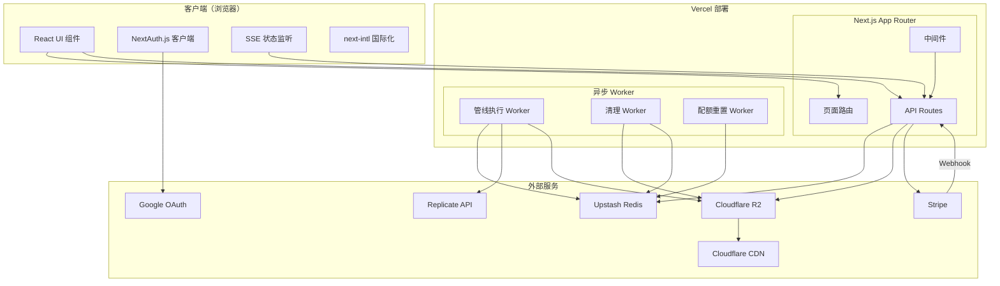
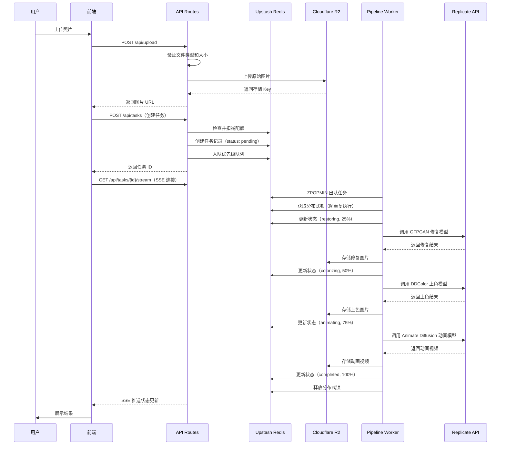
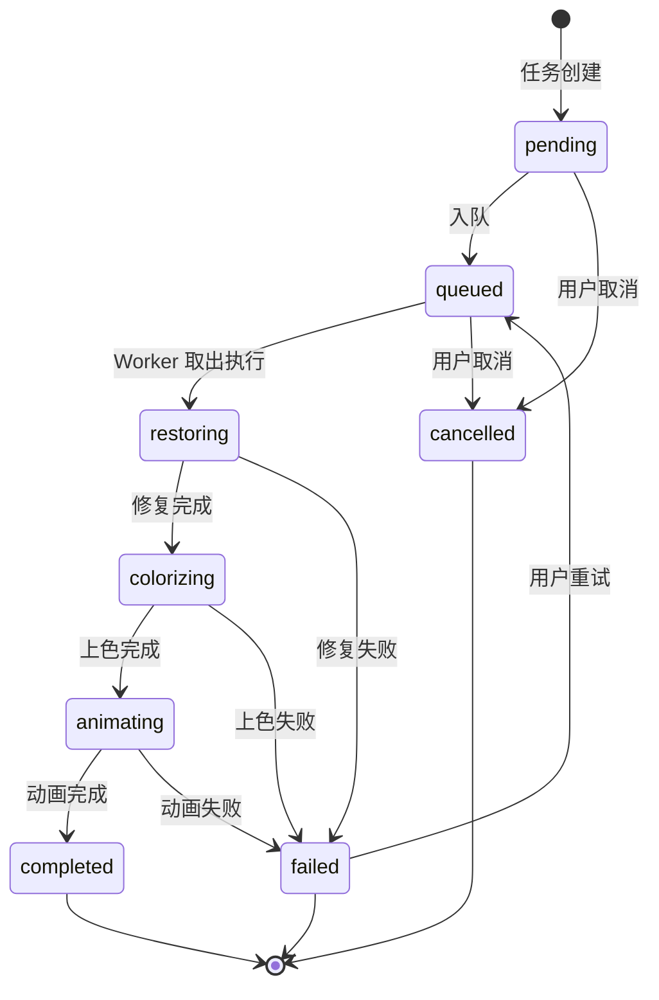

# 设计文档：OldPhotoLive AI

## 概述

OldPhotoLive AI 是一个基于 Next.js 14 App Router 的全栈 Web 应用，提供老照片修复、上色和动画的三合一 AI 处理服务。系统采用异步队列架构，前端使用 React + Tailwind CSS，API Routes 负责接收请求和入队，独立 Worker 消费队列执行 AI 处理。外部服务包括 Cloudflare R2（存储）、Upstash Redis（数据管理与队列）、Replicate API（AI 处理）、NextAuth.js（认证）和 Stripe（支付）。

### 关键设计决策

1. **异步队列架构**：API Routes 仅负责接收上传、创建任务、入队；AI 管线由独立 Worker（Vercel Cron / Serverless Function）消费 Redis 优先级队列异步执行，避免 API 超时
2. **Redis 作为主数据存储 + 队列**：使用 Upstash Redis 存储用户、任务、配额数据，同时作为优先级任务队列
3. **顺序处理管线**：修复 → 上色 → 动画按顺序执行，每步结果作为下一步输入
4. **优先级队列**：付费用户任务优先处理，通过 Redis Sorted Set + 权重实现
5. **CDN 加速**：所有媒体文件通过 Cloudflare CDN 分发（禁用自动图片优化以保证一致性）
6. **前端轮询 + SSE**：任务状态通过 Server-Sent Events 推送，减少轮询压力

## 架构

### 系统架构图



### 异步任务处理流程



### Worker 架构

系统包含三个独立 Worker，通过 Vercel Cron Jobs 或 API Route 触发：

1. **Pipeline Worker** (`/api/worker/pipeline`)：消费优先级队列，执行 AI 管线
   - 通过 Vercel Cron 每分钟触发一次
   - 每次执行最多处理 1 个任务（避免超时）
   - 使用 Redis 分布式锁（`lock:task:{taskId}`，TTL=300s）防止重复执行
   - 并发控制：同时最多 3 个高优先级任务、2 个普通任务

2. **Cleanup Worker** (`/api/worker/cleanup`)：清理失败任务的 R2 中间文件
   - 通过 Vercel Cron 每小时触发一次
   - 清理超过 7 天的失败任务文件

3. **Quota Reset Worker** (`/api/worker/quota-reset`)：每日重置免费用户配额
   - 通过 Vercel Cron 每天 UTC 00:00 触发

## 组件与接口

### 目录结构

```
oldphotolive-ai/
├── messages/
│   ├── en.json                            # 英文翻译文件
│   └── zh.json                            # 中文翻译文件
├── src/
│   ├── app/
│   │   ├── layout.tsx                    # 根布局
│   │   ├── page.tsx                      # 首页（上传区域）
│   │   ├── login/page.tsx                # 登录页
│   │   ├── result/[taskId]/page.tsx      # 结果展示页
│   │   ├── history/page.tsx              # 历史记录页
│   │   ├── pricing/page.tsx              # 定价页
│   │   └── api/
│   │       ├── auth/[...nextauth]/route.ts    # NextAuth 路由
│   │       ├── upload/route.ts                # 图片上传（仅上传到 R2）
│   │       ├── tasks/
│   │       │   ├── route.ts                   # 创建任务（配额检查+入队）
│   │       │   └── [taskId]/
│   │       │       ├── status/route.ts        # 任务状态查询
│   │       │       ├── stream/route.ts        # SSE 状态推送
│   │       │       ├── cancel/route.ts        # 取消任务
│   │       │       └── retry/route.ts         # 重试失败任务
│   │       ├── quota/route.ts                 # 配额查询
│   │       ├── stripe/
│   │       │   ├── checkout/route.ts          # 创建 Checkout 会话
│   │       │   └── webhook/route.ts           # Stripe Webhook
│   │       ├── history/route.ts               # 历史记录
│   │       └── worker/
│   │           ├── pipeline/route.ts          # 管线执行 Worker
│   │           ├── cleanup/route.ts           # 清理 Worker
│   │           └── quota-reset/route.ts       # 配额重置 Worker
│   ├── components/
│   │   ├── UploadZone.tsx             # 拖拽/点击上传组件
│   │   ├── ProgressIndicator.tsx      # 分步进度指示器
│   │   ├── BeforeAfterCompare.tsx     # 前后对比视图
│   │   ├── VideoPlayer.tsx            # 视频播放器
│   │   ├── PricingCards.tsx           # 定价卡片
│   │   ├── TaskHistoryList.tsx        # 历史列表
│   │   ├── Navbar.tsx                 # 导航栏
│   │   ├── LanguageSwitcher.tsx       # 语言切换器
│   │   └── AuthButton.tsx             # 登录/登出按钮
│   ├── i18n/
│   │   ├── request.ts                 # next-intl 请求配置
│   │   └── routing.ts                 # locale 列表与默认 locale
│   ├── lib/
│   │   ├── auth.ts                    # NextAuth 配置
│   │   ├── redis.ts                   # Redis 客户端与操作
│   │   ├── r2.ts                      # R2 存储操作
│   │   ├── replicate.ts              # Replicate API 调用
│   │   ├── stripe.ts                 # Stripe 配置
│   │   ├── pipeline.ts              # AI 处理管线（Worker 调用）
│   │   ├── queue.ts                  # 优先级队列操作
│   │   ├── quota.ts                  # 配额管理
│   │   ├── rateLimit.ts             # 速率限制
│   │   ├── watermark.ts             # 水印处理
│   │   ├── lock.ts                   # Redis 分布式锁
│   │   └── config.ts                # 环境变量验证与配置
│   ├── types/
│   │   └── index.ts                   # TypeScript 类型定义
│   └── middleware.ts                  # 认证与速率限制中间件
├── public/
│   └── watermark.png                  # 水印图片资源
├── next.config.js
├── tailwind.config.ts
├── tsconfig.json
├── package.json
├── vercel.json                        # Cron Jobs 配置
└── .env.example
```

### 核心模块接口

#### 1. 认证模块 (`lib/auth.ts`)

```typescript
import NextAuth from "next-auth";
import GoogleProvider from "next-auth/providers/google";

export const authOptions: AuthOptions = {
  providers: [GoogleProvider({ clientId, clientSecret })],
  callbacks: {
    async signIn({ user }) → boolean,
    async session({ session, token }) → Session,
    async jwt({ token, user }) → JWT,
  },
  session: { strategy: "jwt", maxAge: 30 * 24 * 60 * 60 },
  cookies: { secure: true, httpOnly: true },
};
```

#### 2. Redis 数据操作 (`lib/redis.ts`)

```typescript
// 用户操作
async function createOrGetUser(googleId: string, email: string, name: string): Promise<User>;
async function updateUserTier(userId: string, tier: UserTier): Promise<void>;
async function getUser(userId: string): Promise<User | null>;

// 任务操作
async function createTask(task: CreateTaskInput): Promise<Task>;
async function updateTaskStatus(taskId: string, status: TaskStatus, data?: Partial<Task>): Promise<void>;
async function getTask(taskId: string): Promise<Task | null>;
async function getUserTasks(userId: string): Promise<Task[]>;
async function cancelTask(taskId: string): Promise<boolean>;
async function retryTask(taskId: string): Promise<Task>;
```

#### 3. 优先级队列 (`lib/queue.ts`)

```typescript
// 优先级权重：high = 0（更小的 score 先出队），normal = 1000000
// score = priorityWeight + timestamp（毫秒），保证同优先级 FIFO
const PRIORITY_WEIGHTS = {
  high: 0,
  normal: 1_000_000,
} as const;

async function enqueueTask(taskId: string, priority: "high" | "normal"): Promise<void>;
async function dequeueTask(): Promise<string | null>;  // ZPOPMIN
async function getQueueLength(): Promise<{ high: number; normal: number }>;
async function removeFromQueue(taskId: string): Promise<void>;
```

#### 4. 分布式锁 (`lib/lock.ts`)

```typescript
async function acquireLock(key: string, ttlSeconds: number): Promise<boolean>;
async function releaseLock(key: string): Promise<void>;
// 用于防止同一任务被多个 Worker 重复执行
// key 格式: lock:task:{taskId}，TTL=300s
```

#### 5. R2 存储操作 (`lib/r2.ts`)

```typescript
import { S3Client, PutObjectCommand } from "@aws-sdk/client-s3";

async function uploadToR2(file: Buffer, key: string, contentType: string): Promise<string>;
async function getR2CdnUrl(key: string): string;  // 返回 CDN URL: https://{R2_DOMAIN}/{key}
async function deleteFromR2(key: string): Promise<void>;
async function deleteTaskFiles(taskId: string): Promise<void>;  // 清理任务所有文件
```

#### 6. AI 处理管线 (`lib/pipeline.ts`)

```typescript
// 由 Worker 调用，非 API Route 直接调用
async function executePipeline(taskId: string): Promise<void>;

// 内部步骤
async function runRestoration(imageUrl: string): Promise<string>;
async function runColorization(imageUrl: string): Promise<string>;
async function runAnimation(imageUrl: string): Promise<string>;
async function applyTierSettings(taskId: string, userTier: UserTier): Promise<void>;
```

#### 7. Replicate API 调用 (`lib/replicate.ts`)

```typescript
import Replicate from "replicate";

const MODELS = {
  restoration: "tencentarc/gfpgan:9283608cc6b7...",
  colorization: "piddnad/ddcolor:8ca1066c7138...",
  animation: "anotherframe/animate-diffusion:26d6c9f70b69...",
} as const;

const ANIMATION_PARAMS = {
  motion_bucket_id: 1,
  fps: 24,
  duration: 4,
  output_format: "mp4",
} as const;

// 模型版本和参数为只读常量，不接受外部覆盖
async function runModel(modelKey: keyof typeof MODELS, input: Record<string, unknown>): Promise<string>;
```

#### 8. 配额管理 (`lib/quota.ts`)

```typescript
async function checkAndDecrementQuota(userId: string, userTier: UserTier): Promise<QuotaCheckResult>;
async function getQuotaInfo(userId: string): Promise<QuotaInfo>;
async function initializeFreeQuota(userId: string): Promise<void>;
async function addCredits(userId: string, count: number, expirationDays: number): Promise<void>;
async function resetAllDailyQuotas(): Promise<void>;
async function cleanExpiredCredits(userId: string): Promise<void>;  // 检查并清理过期积分
```

#### 9. 速率限制 (`lib/rateLimit.ts`)

```typescript
// 滑动窗口速率限制
// windowId = Math.floor(Date.now() / windowMs)
// Redis Key: ratelimit:{type}:{userId}:{windowId}，EXPIRE = windowMs/1000
async function checkRateLimit(
  identifier: string,
  type: "api" | "upload"
): Promise<{ allowed: boolean; remaining: number; resetAt: number }>;

const RATE_LIMITS = {
  api: { maxRequests: 100, windowMs: 3_600_000 },
  upload: { maxRequests: 10, windowMs: 3_600_000 },
} as const;
```

#### 10. 水印处理 (`lib/watermark.ts`)

```typescript
// 图片水印：右下角，透明度 30%，文字 "OldPhotoLive AI"
// 使用 sharp 库处理
async function applyImageWatermark(imageBuffer: Buffer): Promise<Buffer>;

// 视频水印：右下角，透明度 30%，文字 "OldPhotoLive AI"
// 使用 ffmpeg-wasm 处理
async function applyVideoWatermark(videoBuffer: Buffer): Promise<Buffer>;

// 分辨率设置
const RESOLUTION_CONFIG = {
  free: { maxWidth: 800, maxHeight: 600, videoQuality: "720p" },
  paid: { maxWidth: 1920, maxHeight: 1080, videoQuality: "1080p" },
} as const;

async function resizeImage(imageBuffer: Buffer, tier: UserTier): Promise<Buffer>;
```

#### 11. 配置管理 (`lib/config.ts`)

```typescript
function validateEnvVars(): void;  // 启动时验证，缺失则抛出错误并列出变量名

const config = {
  google: { clientId: string, clientSecret: string },
  redis: { url: string, token: string },
  r2: { accountId: string, accessKeyId: string, secretAccessKey: string, bucketName: string, publicDomain: string },
  replicate: { apiToken: string },
  stripe: { secretKey: string, webhookSecret: string, priceIds: { payAsYouGo: string, professional: string } },
  nextauth: { secret: string, url: string },
} as const;
```

### 环境变量清单 (`.env.example`)

```bash
# Google OAuth
GOOGLE_CLIENT_ID=
GOOGLE_CLIENT_SECRET=

# NextAuth
NEXTAUTH_SECRET=
NEXTAUTH_URL=https://oldphotoliveai.com

# Upstash Redis
UPSTASH_REDIS_REST_URL=
UPSTASH_REDIS_REST_TOKEN=

# Cloudflare R2
R2_ACCOUNT_ID=
R2_ACCESS_KEY_ID=
R2_SECRET_ACCESS_KEY=
R2_BUCKET_NAME=oldphotolive-ai
NEXT_PUBLIC_R2_DOMAIN=cdn.oldphotoliveai.com

# Replicate
REPLICATE_API_TOKEN=

# Stripe
STRIPE_SECRET_KEY=
STRIPE_WEBHOOK_SECRET=
STRIPE_PRICE_PAY_AS_YOU_GO=
STRIPE_PRICE_PROFESSIONAL=

# Worker 安全密钥（防止外部触发 Worker）
WORKER_SECRET=
```

### API 路由设计

| 路由 | 方法 | 描述 | 认证 | 速率限制 |
|------|------|------|------|----------|
| `/api/auth/[...nextauth]` | GET/POST | NextAuth 认证 | 否 | api |
| `/api/upload` | POST | 图片上传到 R2（仅上传） | 是 | upload |
| `/api/tasks` | POST | 创建任务（配额检查+入队） | 是 | api |
| `/api/tasks/[taskId]/status` | GET | 查询任务状态 | 是 | api |
| `/api/tasks/[taskId]/stream` | GET | SSE 状态推送 | 是 | 否 |
| `/api/tasks/[taskId]/cancel` | POST | 取消任务 | 是 | api |
| `/api/tasks/[taskId]/retry` | POST | 重试失败任务 | 是 | api |
| `/api/quota` | GET | 查询用户配额 | 是 | api |
| `/api/stripe/checkout` | POST | 创建 Stripe Checkout | 是 | api |
| `/api/stripe/webhook` | POST | Stripe Webhook 回调 | 否 | 否 |
| `/api/history` | GET | 获取任务历史 | 是 | api |
| `/api/worker/pipeline` | POST | 管线 Worker（Cron 触发） | Worker Secret | 否 |
| `/api/worker/cleanup` | POST | 清理 Worker（Cron 触发） | Worker Secret | 否 |
| `/api/worker/quota-reset` | POST | 配额重置 Worker（Cron 触发） | Worker Secret | 否 |

### Vercel Cron 配置 (`vercel.json`)

```json
{
  "crons": [
    { "path": "/api/worker/pipeline", "schedule": "* * * * *" },
    { "path": "/api/worker/cleanup", "schedule": "0 * * * *" },
    { "path": "/api/worker/quota-reset", "schedule": "0 0 * * *" }
  ]
}
```

## 数据模型

### Redis 数据结构

所有数据存储在 Upstash Redis 中，使用 JSON 序列化（JSON.stringify / JSON.parse）。

#### User（用户）

```typescript
interface User {
  id: string;                    // UUID
  googleId: string;              // Google OAuth ID
  email: string;
  name: string;
  avatarUrl: string | null;
  tier: UserTier;
  createdAt: string;             // ISO 8601
  updatedAt: string;             // ISO 8601
}

type UserTier = "free" | "pay_as_you_go" | "professional";
```

Redis Key: `user:{userId}` → JSON  
索引: `user:google:{googleId}` → userId

#### Task（任务）

```typescript
interface Task {
  id: string;                    // UUID
  userId: string;
  status: TaskStatus;
  priority: "normal" | "high";
  originalImageKey: string;      // R2 存储 Key
  restoredImageKey: string | null;
  colorizedImageKey: string | null;
  animationVideoKey: string | null;
  errorMessage: string | null;
  progress: number;              // 0-100
  createdAt: string;             // ISO 8601
  completedAt: string | null;    // ISO 8601
}

type TaskStatus = "pending" | "queued" | "restoring" | "colorizing" | "animating" | "completed" | "failed" | "cancelled";
```

Redis Key: `task:{taskId}` → JSON  
用户任务索引: `user:{userId}:tasks` → Sorted Set（score = 创建时间戳）

#### 优先级队列

Redis Key: `queue:tasks` → Sorted Set

Score 计算规则：
- `high` 优先级: `score = 0 + timestamp_ms`（更小的 score 先出队）
- `normal` 优先级: `score = 1_000_000_000_000_000 + timestamp_ms`

这样保证所有 high 任务的 score 都小于 normal 任务，ZPOPMIN 自然先出队高优先级任务。同优先级内按时间戳 FIFO。

#### Quota（配额）

```typescript
interface QuotaInfo {
  userId: string;
  tier: UserTier;
  remaining: number;
  dailyLimit: number | null;       // 免费用户为 1
  resetAt: string | null;          // ISO 8601，UTC 次日 00:00
  credits: number;                 // 按次付费积分
  creditsExpireAt: string | null;  // ISO 8601，积分过期时间
}
```

Redis Key: `quota:{userId}` → JSON  
每日重置集合: `quota:daily:users` → Set（存储所有免费用户 ID）

积分过期逻辑：
- 创建任务时先调用 `cleanExpiredCredits()` 检查积分是否过期
- 如果 `creditsExpireAt < now`，将 credits 清零
- Cleanup Worker 每小时批量清理过期积分

#### Rate Limit（速率限制）

Redis Key: `ratelimit:{type}:{userId}:{windowId}` → count  
- `windowId = Math.floor(Date.now() / windowMs)`
- 使用 Redis INCR + EXPIRE（TTL = windowMs / 1000 + 1）

#### 分布式锁

Redis Key: `lock:task:{taskId}` → "locked"  
- 使用 SET NX EX 实现
- TTL = 300 秒（5 分钟，覆盖单个任务最大处理时间）

### 状态机：任务处理流程



### 进度百分比映射

| 状态 | 进度 |
|------|------|
| pending | 0% |
| queued | 5% |
| restoring | 25% |
| colorizing | 50% |
| animating | 75% |
| completed | 100% |
| failed | 保持失败时的进度 |
| cancelled | 保持取消时的进度 |

### 用户层级转换规则

| 当前层级 | 操作 | 新层级 | 积分处理 |
|----------|------|--------|----------|
| free | 购买按次付费 | pay_as_you_go | 添加 5 积分 |
| free | 购买专业订阅 | professional | 无积分概念 |
| pay_as_you_go | 购买按次付费 | pay_as_you_go | 累加 5 积分，刷新过期时间 |
| pay_as_you_go | 购买专业订阅 | professional | 剩余积分保留但冻结 |
| professional | 订阅续费失败 | free | 如有冻结积分则恢复 |
| professional | 购买按次付费 | professional | 忽略（已是更高层级） |

## 国际化（i18n）模块

### 技术方案

使用 `next-intl` 库实现 Next.js 14 App Router 的国际化支持。

### 关键设计决策

1. **next-intl**：专为 Next.js App Router 设计的 i18n 库，支持 Server Components 和 Client Components
2. **中间件 locale 检测**：通过 Next.js middleware 检测用户语言偏好（Cookie > Accept-Language > 默认英文）
3. **JSON 消息文件**：按语言分离的 JSON 文件存储翻译文本，结构化命名空间管理
4. **Cookie 持久化**：用户语言偏好存储在 Cookie 中，后续访问自动应用

### 目录结构变更

```
oldphotolive-ai/
├── messages/
│   ├── en.json                        # 英文翻译文件
│   └── zh.json                        # 中文翻译文件
├── src/
│   ├── i18n/
│   │   ├── request.ts                 # next-intl 请求配置
│   │   └── routing.ts                 # 支持的 locale 列表与默认 locale
│   ├── components/
│   │   ├── LanguageSwitcher.tsx        # 语言切换器组件
│   │   └── ...（现有组件）
│   ├── middleware.ts                   # 更新：集成 next-intl 中间件
│   └── ...
└── next.config.js                     # 更新：集成 next-intl 插件
```

### 消息文件结构

消息文件按功能模块组织命名空间：

```json
{
  "common": {
    "appName": "OldPhotoLive AI",
    "loading": "Loading...",
    "error": "An error occurred",
    "retry": "Retry",
    "download": "Download",
    "cancel": "Cancel"
  },
  "nav": {
    "home": "Home",
    "history": "History",
    "pricing": "Pricing",
    "login": "Sign In",
    "logout": "Sign Out"
  },
  "upload": {
    "title": "Restore Your Old Photos",
    "dragDrop": "Drag and drop your photo here",
    "browse": "Browse Files",
    "supportedFormats": "Supports JPEG, PNG, WebP (max 10MB)",
    "uploading": "Uploading..."
  },
  "processing": {
    "step1": "Upload",
    "step2": "Restore",
    "step3": "Colorize",
    "step4": "Animate",
    "pending": "Waiting in queue...",
    "completed": "Processing complete"
  },
  "result": {
    "before": "Before",
    "after": "After",
    "downloadImage": "Download Image",
    "downloadVideo": "Download Video",
    "failed": "Processing failed",
    "retryMessage": "Something went wrong. Please try again."
  },
  "pricing": {
    "title": "Choose Your Plan",
    "free": "Free",
    "payAsYouGo": "Pay As You Go",
    "professional": "Professional",
    "recommended": "Recommended",
    "perDay": "/day",
    "credits": "credits",
    "unlimited": "Unlimited",
    "subscribe": "Subscribe",
    "buyCredits": "Buy Credits"
  },
  "history": {
    "title": "Processing History",
    "empty": "No processing history yet",
    "status": {
      "pending": "Pending",
      "queued": "Queued",
      "restoring": "Restoring",
      "colorizing": "Colorizing",
      "animating": "Animating",
      "completed": "Completed",
      "failed": "Failed",
      "cancelled": "Cancelled"
    }
  },
  "errors": {
    "fileTypeNotSupported": "Please upload a JPEG, PNG, or WebP image",
    "fileTooLarge": "File size must not exceed 10MB",
    "uploadFailed": "Upload failed. Please try again later.",
    "quotaExceeded": "Daily free quota used up. Upgrade or try again tomorrow.",
    "creditsExpired": "Credits have expired. Please purchase again.",
    "rateLimited": "Too many requests. Please try again later.",
    "paymentFailed": "Payment failed: {reason}",
    "taskNotFound": "Task not found",
    "cannotCancel": "This task cannot be cancelled",
    "unauthorized": "Please sign in to continue",
    "processingTimeout": "Processing timed out. Please click retry.",
    "serviceBusy": "Service is temporarily busy. Your task has been queued."
  },
  "auth": {
    "signInWith": "Sign in with Google",
    "signInPrompt": "Sign in to start restoring your photos"
  },
  "quota": {
    "remaining": "{count} remaining",
    "resetsAt": "Resets at {time}",
    "unlimited": "Unlimited"
  }
}
```

### 核心接口

#### i18n 路由配置 (`src/i18n/routing.ts`)

```typescript
export const locales = ["en", "zh"] as const;
export type Locale = (typeof locales)[number];
export const defaultLocale: Locale = "en";
```

#### i18n 请求配置 (`src/i18n/request.ts`)

```typescript
import { getRequestConfig } from "next-intl/server";
import { getUserLocale } from "./routing";

export default getRequestConfig(async () => {
  const locale = await getUserLocale();
  return {
    locale,
    messages: (await import(`../../messages/${locale}.json`)).default,
  };
});
```

#### 语言切换器组件 (`src/components/LanguageSwitcher.tsx`)

```typescript
// 下拉式语言切换器，显示在导航栏中
// 切换时设置 Cookie 并刷新页面以应用新 locale
// 显示当前语言标识（EN / 中文）
interface LanguageSwitcherProps {
  currentLocale: Locale;
}
```

### API 错误消息国际化

API 路由通过请求头 `Accept-Language` 或 Cookie 中的 locale 偏好确定响应语言：

```typescript
// 在 API 路由中获取 locale
function getRequestLocale(request: Request): Locale {
  const cookieLocale = getCookieLocale(request);
  if (cookieLocale) return cookieLocale;
  const acceptLang = request.headers.get("Accept-Language");
  // 解析 Accept-Language 并匹配支持的 locale
  return matchLocale(acceptLang) ?? defaultLocale;
}

// 获取翻译后的错误消息
function getErrorMessage(key: string, locale: Locale, params?: Record<string, string>): string;
```

### 中间件集成

更新现有 `src/middleware.ts`，在认证和速率限制检查之外，集成 next-intl 的 locale 检测逻辑：

```typescript
// middleware.ts 更新
// 1. 从 Cookie 或 Accept-Language 检测 locale
// 2. 将 locale 信息注入请求上下文
// 3. 继续执行认证和速率限制检查
```

## 正确性属性

*属性是系统在所有有效执行中应保持为真的特征或行为——本质上是关于系统应该做什么的形式化陈述。属性作为人类可读规范与机器可验证正确性保证之间的桥梁。*

### Property 1: 未认证用户重定向

*对于任意* 未携带有效会话的请求，当该请求访问受保护的路由时，系统应返回重定向到登录页面的响应。

**Validates: Requirements 1.1**

### Property 2: 用户创建幂等性

*对于任意* Google ID、邮箱和名称组合，多次调用 createOrGetUser 应始终返回相同的用户记录（相同的 userId），且 Redis 中只存在一条用户记录。

**Validates: Requirements 1.3**

### Property 3: 会话包含必要信息

*对于任意* 已认证用户的会话对象，该会话应包含用户 ID、邮箱和套餐层级（tier）信息。

**Validates: Requirements 1.4**

### Property 4: 文件上传验证

*对于任意* 上传文件，当文件类型不在 [JPEG, PNG, WebP] 中或文件大小超过 10MB 时，验证应拒绝该文件；当文件类型在支持列表中且大小不超过 10MB 时，验证应通过。

**Validates: Requirements 2.1, 2.2**

### Property 5: 上传标识符唯一性

*对于任意* 两次独立的图片上传操作，生成的存储 Key 应互不相同。

**Validates: Requirements 2.4**

### Property 6: 管线执行顺序

*对于任意* 任务的管线执行，模型调用顺序应严格为：修复（GFPGAN）→ 上色（DDColor）→ 动画（Animate Diffusion），且每一步的输入应为上一步的输出。

**Validates: Requirements 3.1, 3.2, 3.3**

### Property 7: 任务失败处理

*对于任意* 管线执行中某个模型失败的情况，任务状态应更新为 "failed"，errorMessage 应为非空字符串，且后续模型不应被执行。

**Validates: Requirements 3.4, 4.5**

### Property 8: 任务完成处理

*对于任意* 三个模型全部成功完成的管线执行，任务状态应为 "completed"，restoredImageKey、colorizedImageKey 和 animationVideoKey 均应为非空值。

**Validates: Requirements 3.5, 4.4**

### Property 9: 套餐层级决定输出设置

*对于任意* 任务处理，当用户为 Free_User 时，输出应添加水印且使用低分辨率（800×600 / 720p）；当用户为 Paid_User 时，输出不添加水印且使用高分辨率（1920×1080 / 1080p）。

**Validates: Requirements 3.6, 3.7, 3.8**

### Property 10: 管线状态转换一致性

*对于任意* 管线执行过程，任务状态应按 queued → restoring → colorizing → animating → completed（或 failed）的顺序转换，不应跳过中间状态。

**Validates: Requirements 3.10, 4.2**

### Property 11: 任务状态与进度百分比一致性

*对于任意* 任务状态查询，返回的进度百分比应与当前状态匹配：pending=0%、queued=5%、restoring=25%、colorizing=50%、animating=75%、completed=100%。

**Validates: Requirements 4.3**

### Property 12: 任务用户关联

*对于任意* 创建的任务，其 userId 字段应等于创建该任务的用户 ID。

**Validates: Requirements 4.6**

### Property 13: 任务时间戳有效性

*对于任意* 任务，createdAt 应为有效的 ISO 8601 时间戳。对于已完成的任务，completedAt 也应为有效时间戳且 completedAt >= createdAt。

**Validates: Requirements 4.7**

### Property 14: 免费用户配额初始化

*对于任意* 新创建的 Free_User，其配额 remaining 应为 1，dailyLimit 应为 1。

**Validates: Requirements 5.1**

### Property 15: 免费用户配额执行

*对于任意* 拥有 remaining > 0 的 Free_User，创建任务后 remaining 应减 1；当 remaining = 0 时，任务创建应被拒绝且配额不变。

**Validates: Requirements 5.2, 5.3, 5.8**

### Property 16: 每日配额重置

*对于任意* Free_User 集合，执行每日重置后，所有 Free_User 的 remaining 应恢复为 1。

**Validates: Requirements 5.4**

### Property 17: 付费用户配额行为

*对于任意* pay_as_you_go 用户（积分未过期），创建任务后积分应减 1；*对于任意* professional 用户，创建任务不应修改任何配额值。

**Validates: Requirements 5.5, 5.6**

### Property 18: Webhook 支付更新用户层级

*对于任意* 有效的 checkout.session.completed Webhook 事件，系统应正确更新对应用户的套餐层级和配额。

**Validates: Requirements 6.4**

### Property 19: Webhook 签名验证

*对于任意* Webhook 请求，当签名无效时应拒绝处理并返回 401；当签名有效时应正常处理事件。

**Validates: Requirements 6.8**

### Property 20: 订阅失败降级

*对于任意* 订阅续费失败事件，用户套餐应降级为 "free"。

**Validates: Requirements 6.7**

### Property 21: 媒体 URL 使用 CDN 域名

*对于任意* 系统生成的媒体文件 URL，该 URL 应使用配置的 NEXT_PUBLIC_R2_DOMAIN 作为域名前缀。

**Validates: Requirements 7.3, 7.4, 7.6**

### Property 22: 任务历史正确性

*对于任意* 用户的历史查询，返回的任务列表应仅包含属于该用户的任务，且按 createdAt 降序排列。

**Validates: Requirements 8.1, 8.4**

### Property 23: 速率限制执行

*对于任意* 用户和请求类型（api/upload），当该用户在当前滑动窗口内的请求数超过限制（api: 100, upload: 10）时，后续请求应返回 429 状态码；当窗口过期后，请求应被允许。

**Validates: Requirements 9.2, 9.3, 9.4, 9.5**

### Property 24: 环境变量验证

*对于任意* 必需环境变量集合，当其中任一变量缺失时，validateEnvVars 应抛出错误且错误信息应包含缺失变量的名称。

**Validates: Requirements 12.2, 12.3**

### Property 25: 优先级分配

*对于任意* 任务创建，当用户为 Paid_User 时优先级应为 "high"，当用户为 Free_User 时优先级应为 "normal"。

**Validates: Requirements 14.1, 14.2**

### Property 26: 优先级队列排序

*对于任意* 包含混合优先级任务的队列，出队顺序应先处理所有 "high" 优先级任务，再处理 "normal" 优先级任务；同一优先级内按创建时间先进先出。

**Validates: Requirements 14.3, 14.4**

### Property 27: 固定模型配置不可变

*对于任意* 模型调用，使用的模型版本和动画参数应与系统配置的固定值完全一致，不接受外部覆盖。

**Validates: Requirements 16.1, 16.2, 16.3**

### Property 28: 任务数据序列化往返一致性

*对于任意* 有效的 Task 对象，序列化为 JSON 存入 Redis 后再反序列化，得到的对象应与原始对象等价。

**Validates: Requirements 3.9, 4.1**

### Property 29: 分布式锁互斥性

*对于任意* 任务 ID，当一个 Worker 持有该任务的锁时，其他 Worker 尝试获取同一锁应失败。

**Validates: Requirements 14.3（队列消费不重复执行）**

### Property 30: 积分过期清理

*对于任意* pay_as_you_go 用户，当 creditsExpireAt 早于当前时间时，cleanExpiredCredits 应将 credits 清零。

**Validates: Requirements 5.5（积分有效期管理）**

### Property 31: 默认语言为英文

*对于任意* 未设置语言偏好的新用户请求，系统应使用英文（en）作为界面语言。

**Validates: Requirements 18.2**

### Property 32: 语言切换完整性

*对于任意* 支持的 locale（en 或 zh）和消息文件中的翻译键，两种语言的消息文件应包含完全相同的键集合，确保不存在缺失翻译。

**Validates: Requirements 18.4**

### Property 33: API 错误消息国际化

*对于任意* API 错误响应和请求 locale，返回的错误消息应为对应 locale 的翻译文本，而非硬编码文本。

**Validates: Requirements 18.5**

### Property 34: 语言偏好持久化往返一致性

*对于任意* 支持的 locale，设置语言偏好后再读取，得到的 locale 应与设置的值一致。

**Validates: Requirements 18.7**

## 错误处理

### 错误分类与处理策略

| 错误类型 | 处理策略 | 用户反馈 | HTTP 状态码 |
|----------|----------|----------|-------------|
| 文件类型不支持 | 立即拒绝 | "请上传 JPEG、PNG 或 WebP 格式的图片" | 400 |
| 文件过大 | 立即拒绝 | "文件大小不能超过 10MB" | 400 |
| R2 上传失败 | 重试 2 次，失败返回错误 | "上传失败，请稍后重试" | 500 |
| Replicate API 超时 | 重试 2 次，失败标记任务为 failed | "处理超时，请点击重试" | - |
| Replicate API 不可用 | 任务保留在队列中等待下次 Worker 执行 | "服务暂时繁忙，任务已排队等待" | - |
| 配额不足 | 立即拒绝 | "今日免费额度已用完，请升级或明天再试" | 403 |
| 积分过期 | 清零积分，拒绝任务 | "积分已过期，请重新购买" | 403 |
| 速率限制 | 返回 429 + Retry-After 头 | "请求过于频繁，请稍后重试" | 429 |
| Stripe 支付失败 | 返回 Stripe 错误信息 | "支付失败：[具体原因]" | 400 |
| Webhook 签名无效 | 拒绝处理，记录日志 | 无用户反馈 | 401 |
| 环境变量缺失 | 启动失败，记录缺失变量 | 无用户反馈（部署问题） | - |
| 未认证访问 | 重定向到登录页 | 登录页面提示 | 302 |
| 不支持的语言 | 回退到默认语言（en） | 使用英文界面 | - |
| 翻译键缺失 | 回退到键名本身 | 显示翻译键名 | - |
| 任务不存在 | 返回 404 | "任务不存在" | 404 |
| 任务取消（非 pending/queued） | 拒绝取消 | "该任务无法取消" | 400 |

### 重试策略

```typescript
const RETRY_CONFIG = {
  maxRetries: 2,
  baseDelay: 1000,
  maxDelay: 10000,
  backoffMultiplier: 2,   // 指数退避
};

async function withRetry<T>(
  fn: () => Promise<T>,
  config = RETRY_CONFIG
): Promise<T>;
```

适用场景：
- R2 上传/下载操作
- Replicate API 调用
- Redis 操作（网络抖动）

### 任务失败后清理

当任务失败时：
1. Worker 将任务状态更新为 "failed"，记录 errorMessage
2. 释放分布式锁
3. Cleanup Worker 定期扫描失败任务，删除 R2 中间文件
4. 超过 7 天的失败任务文件自动清理

### 错误日志

所有 API 错误记录以下信息：
- 时间戳（ISO 8601）
- 请求路径和方法
- 用户 ID（如有）
- 错误类型和消息
- 堆栈跟踪（仅开发环境）
- 使用 Vercel Logs 存储和查看

## 测试策略

### 测试框架选择

- **单元测试**: Jest + React Testing Library
- **属性基测试**: fast-check（TypeScript 属性基测试库）
- **Mock**: jest-mock 用于模拟外部服务（Redis、R2、Replicate、Stripe）

### 测试环境隔离

- 使用独立的测试 Redis 实例（Upstash 提供免费测试实例）
- 使用独立的测试 R2 Bucket（`oldphotolive-ai-test`）
- 所有外部 API 调用在单元测试中使用 Mock
- 属性基测试中使用内存模拟的 Redis/R2 实现
- 环境变量通过 `.env.test` 文件配置

### 属性基测试配置

每个属性测试应运行至少 100 次迭代。每个测试应通过注释引用设计文档中的属性编号。

标签格式: `Feature: oldphotolive-ai, Property {number}: {property_text}`

每个正确性属性必须由单个属性基测试实现。

### 测试分层

#### 单元测试（Jest）

针对具体示例、边界情况和错误条件：

- **文件验证**: 测试各种文件类型和大小的边界值（恰好 10MB、0 字节等）
- **配额管理**: 测试配额为 0、1 的边界情况，积分过期边界
- **速率限制**: 测试恰好达到限制的边界情况
- **环境变量验证**: 测试各种缺失组合
- **Webhook 处理**: 测试各种支付事件类型（按次付费、专业订阅、续费失败）
- **任务状态机**: 测试无效状态转换（如 completed → restoring）
- **队列操作**: 测试空队列出队、重复入队
- **分布式锁**: 测试锁获取、释放、超时
- **任务取消/重试**: 测试各种状态下的取消和重试行为

#### 属性基测试（fast-check）

针对通用属性，覆盖所有有效输入：

- **Property 2**: 用户创建幂等性 — 生成随机 Google ID 和用户信息
- **Property 4**: 文件验证 — 生成随机文件类型和大小
- **Property 5**: 标识符唯一性 — 生成多次上传操作
- **Property 6**: 管线执行顺序 — 生成随机任务配置，验证调用顺序
- **Property 9**: 套餐层级输出设置 — 生成随机用户层级
- **Property 10**: 状态转换一致性 — 生成随机管线执行序列
- **Property 11**: 状态-进度映射 — 生成随机任务状态
- **Property 15**: 配额执行 — 生成随机配额值和操作序列
- **Property 16**: 每日重置 — 生成随机免费用户集合
- **Property 17**: 付费用户配额 — 生成随机付费用户类型和操作
- **Property 22**: 历史排序 — 生成随机任务列表
- **Property 23**: 速率限制 — 生成随机请求序列
- **Property 24**: 环境变量验证 — 生成随机环境变量子集
- **Property 25**: 优先级分配 — 生成随机用户层级
- **Property 26**: 队列排序 — 生成随机优先级任务集合
- **Property 28**: 序列化往返 — 生成随机 Task 对象
- **Property 29**: 分布式锁互斥 — 生成随机锁操作序列
- **Property 30**: 积分过期 — 生成随机过期时间
- **Property 31**: 默认语言 — 生成无语言偏好的请求
- **Property 32**: 语言切换完整性 — 比较两种语言消息文件的键集合
- **Property 33**: API 错误消息国际化 — 生成随机错误类型和 locale 组合
- **Property 34**: 语言偏好持久化 — 生成随机 locale 设置和读取操作

### 测试目录结构

```
__tests__/
├── unit/
│   ├── validation.test.ts
│   ├── quota.test.ts
│   ├── rateLimit.test.ts
│   ├── config.test.ts
│   ├── webhook.test.ts
│   ├── pipeline.test.ts
│   ├── queue.test.ts
│   ├── lock.test.ts
│   └── redis.test.ts
├── property/
│   ├── validation.property.test.ts
│   ├── quota.property.test.ts
│   ├── rateLimit.property.test.ts
│   ├── config.property.test.ts
│   ├── pipeline.property.test.ts
│   ├── priority.property.test.ts
│   ├── history.property.test.ts
│   ├── serialization.property.test.ts
│   ├── lock.property.test.ts
│   └── credits.property.test.ts
├── property/
│   └── i18n.property.test.ts
└── mocks/
    ├── redis.mock.ts
    ├── r2.mock.ts
    ├── replicate.mock.ts
    └── stripe.mock.ts
```

### MVP 验证优先级

按照用户建议，实现和测试优先级为：
1. **核心管线**：图片上传 → AI 处理管线 → 结果展示（先验证 MVP）
2. **配额与队列**：配额管理、优先级队列、Worker 执行
3. **认证与会话**：Google OAuth、会话管理
4. **支付**：Stripe 集成、Webhook 处理
