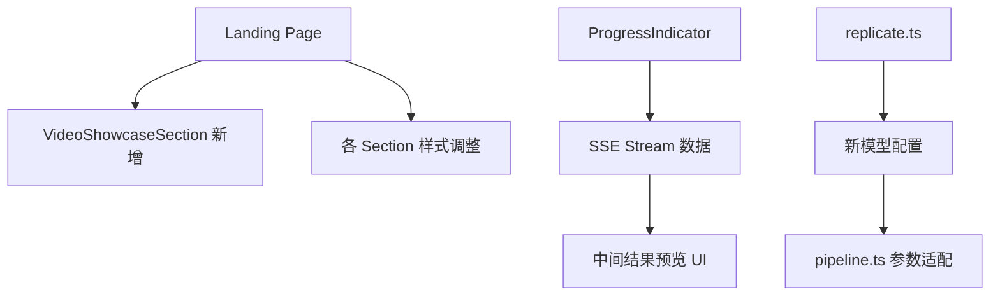

# 设计文档：UX & Pipeline 升级

## 概述

本设计涵盖三个相关改进：

1. **落地页视频展示 + 样式优化**：在 ShowcaseSection 下方新增视频展示区域，播放 R2 上已有的动画示例；同时缩减各区块间距使布局更紧凑。
2. **处理过程中间结果实时预览**：扩展 ProgressIndicator 组件，在 SSE 推送中间结果键时实时展示修复图、上色图、动画视频的缩略图预览。
3. **替换动画模型**：将 `minimax/video-01-live` 替换为 `stability-ai/stable-video-diffusion`，降低单次成本至 ~$0.04。

## 架构

整体架构不变，改动集中在以下层面：



**不变的部分**：
- SSE stream route 已经推送 `restoredImageKey`、`colorizedImageKey`、`animationVideoKey`，无需修改
- R2 上传/CDN URL 生成逻辑不变
- Redis 任务状态结构不变

## 组件与接口

### 1. VideoShowcaseSection（新增组件）

**文件**：`src/app/sections/VideoShowcaseSection.tsx`

```typescript
// 新增落地页视频展示区块
// 复用已有的 VideoPlayer 组件
// 视频源：R2 CDN 上的示例动画

interface VideoShowcaseProps {}

export default function VideoShowcaseSection(): JSX.Element
```

**实现要点**：
- 使用已有的 `VideoPlayer` 组件，传入 R2 CDN URL
- 视频 URL：`https://pub-1d53303d843e4e19a071284a6933ffb6.r2.dev/tasks/acbfdf8a-19a1-47a9-a7ed-f1ee883ef013/animation.mp4`
- 不设置 `crossOrigin="anonymous"`（VideoPlayer 组件当前不设置，保持不变）
- 使用 next-intl 国际化标题和描述
- 在 `src/app/page.tsx` 中插入到 ShowcaseSection 之后

### 2. 落地页样式调整

**涉及文件**：所有 `src/app/sections/*.tsx`

**调整策略**：
| 区块 | 当前间距 | 目标间距 |
|------|---------|---------|
| HeroSection | `py-20 sm:py-32` | `py-12 sm:py-16` |
| ShowcaseSection | `py-16 sm:py-24` | `py-10 sm:py-14` |
| VideoShowcaseSection | 新增 | `py-10 sm:py-14` |
| FeaturesSection | `py-16 sm:py-24` | `py-10 sm:py-14` |
| HowItWorksSection | `py-16 sm:py-24` | `py-10 sm:py-14` |
| UploadSection | `py-16 sm:py-24` | `py-10 sm:py-14` |
| FAQSection | `py-16 sm:py-24` | `py-10 sm:py-14` |

各区块内部的 `mt-12` 等间距也相应缩减为 `mt-8`。

### 3. ProgressIndicator 扩展（中间结果预览）

**文件**：`src/components/ProgressIndicator.tsx`

**新增接口**：
```typescript
// 扩展 SSE 数据处理，新增中间结果状态
interface IntermediateResults {
  restoredImageKey?: string;
  colorizedImageKey?: string;
  animationVideoKey?: string;
}

// 新增 props
interface ProgressIndicatorProps {
  taskId: string;
  onComplete?: (task: { status: string; progress: number; [key: string]: unknown }) => void;
  onError?: (error: string) => void;
}
```

**实现要点**：
- 新增 `intermediateResults` state 存储 SSE 推送的中间结果键
- 在 `es.onmessage` 中提取 `restoredImageKey`、`colorizedImageKey`、`animationVideoKey`
- 新增 `buildPreviewUrl(key: string)` 辅助函数，将 R2 key 转为 CDN URL
- 在每个已完成步骤下方渲染缩略图预览：
  - 修复完成：显示 `` 缩略图
  - 上色完成：显示 `` 缩略图
  - 动画完成：显示 `<video>` 缩略图（使用 VideoPlayer 或简单 video 标签）
- 不设置 `crossOrigin="anonymous"`
- 预览图使用小尺寸（如 `max-w-[120px]`），不影响整体进度条布局

**CDN URL 构建**：
```typescript
function buildPreviewUrl(key: string): string {
  const domain = process.env.NEXT_PUBLIC_R2_DOMAIN ?? "";
  if (domain.startsWith("http://") || domain.startsWith("https://")) {
    return `${domain}/${key}`;
  }
  return `https://${domain}/${key}`;
}
```

此函数与 `result/[taskId]/page.tsx` 中的 `buildCdnUrl` 逻辑一致，可考虑提取为共享工具函数。

### 4. 动画模型替换

**文件**：`src/lib/replicate.ts`

**变更**：
```typescript
// 旧配置
export const MODELS = {
  // ...
  animation: "minimax/video-01-live",
} as const;

export const ANIMATION_PARAMS = {
  prompt: "Bring this old photo to life with natural facial expressions and subtle movement",
} as const;

// 新配置
export const MODELS = {
  // ...
  animation: "stability-ai/stable-video-diffusion:3f0457e4619daac51203dedb472816fd4af51f3149fa7a9e0b5ffcf1b8172438",
} as const;

export const ANIMATION_PARAMS = {
  video_length: "14_frames_with_svd",
  sizing_strategy: "maintain_aspect_ratio",
  frames_per_second: 6,
  motion_bucket_id: 127,
  cond_aug: 0.02,
} as const;
```

**文件**：`src/lib/pipeline.ts`

**变更**：
```typescript
// 旧代码（Step 3）
const animationOutputUrl = await runModel("animation", { first_frame_image: colorizedCdnUrl });

// 新代码（Step 3）— SVD 使用 input_image 键
const animationOutputUrl = await runModel("animation", { input_image: colorizedCdnUrl });
```

**模型选择理由**：
- `stability-ai/stable-video-diffusion` 在 Replicate 上运行约 $0.03-0.04/次（使用 14 帧配置）
- 远低于 $0.1 预算上限
- 输出质量适合照片动画场景
- 广泛使用，稳定可靠

### 5. i18n 文案更新

**文件**：`messages/en.json` 和 `messages/zh.json`

新增键：
```json
{
  "landing": {
    "videoShowcase": {
      "title": "See It in Motion",
      "subtitle": "Watch how AI brings old photos to life with realistic animation"
    }
  },
  "processing": {
    "previewRestored": "Restored",
    "previewColorized": "Colorized",
    "previewAnimation": "Animation"
  }
}
```

中文：
```json
{
  "landing": {
    "videoShowcase": {
      "title": "动态效果展示",
      "subtitle": "看 AI 如何让老照片栩栩如生"
    }
  },
  "processing": {
    "previewRestored": "修复效果",
    "previewColorized": "上色效果",
    "previewAnimation": "动画效果"
  }
}
```

## 数据模型

无新增数据模型。现有的 Redis Task 结构已包含所有需要的字段：

```typescript
interface Task {
  id: string;
  userId: string;
  status: TaskStatus;
  priority: string;
  originalImageKey: string;
  restoredImageKey: string | null;    // 已有，SSE 已推送
  colorizedImageKey: string | null;   // 已有，SSE 已推送
  animationVideoKey: string | null;   // 已有，SSE 已推送
  errorMessage: string | null;
  progress: number;
  createdAt: string;
  completedAt: string | null;
}
```

`ANIMATION_PARAMS` 类型变更：
```typescript
// 旧类型（推断）
{ prompt: string }

// 新类型（推断）
{
  video_length: string;
  sizing_strategy: string;
  frames_per_second: number;
  motion_bucket_id: number;
  cond_aug: number;
}
```


## 正确性属性

*正确性属性是一种在系统所有有效执行中都应成立的特征或行为——本质上是关于系统应该做什么的形式化陈述。属性是人类可读规范与机器可验证正确性保证之间的桥梁。*

### Property 1: CDN URL 构建正确性

*For any* R2 存储键字符串 key，`buildPreviewUrl(key)` 的输出 SHALL 以 `NEXT_PUBLIC_R2_DOMAIN` 的值为前缀，并以 `/{key}` 结尾。当 domain 已包含 `https://` 前缀时不重复添加协议头。

**Validates: Requirements 3.4**

### Property 2: 中间结果预览渲染

*For any* SSE 事件数据，当其包含非空的中间结果键（`restoredImageKey`、`colorizedImageKey` 或 `animationVideoKey`）时，ProgressIndicator SHALL 渲染对应的预览元素（img 或 video），且预览元素的 src 属性等于 `buildPreviewUrl(key)` 的返回值。

**Validates: Requirements 3.1, 3.2, 3.3**

### Property 3: 缺失键不渲染预览

*For any* SSE 事件数据，当其不包含某个中间结果键（或键值为空）时，ProgressIndicator SHALL 不渲染该步骤对应的预览元素。

**Validates: Requirements 3.6**

### Property 4: Pipeline 使用正确的输入参数键

*For any* pipeline 执行，当执行动画步骤时，传递给 `runModel("animation", input)` 的 input 对象 SHALL 包含 `input_image` 键（而非 `first_frame_image`），且其值为上色后图片的 CDN URL。

**Validates: Requirements 4.2**

### Property 5: Pipeline 正确处理新模型输出

*For any* 成功的 pipeline 执行，当动画模型返回有效输出 URL 时，pipeline SHALL 下载该输出并上传到 R2 的 `tasks/{taskId}/animation.mp4` 路径，最终将任务标记为 completed。

**Validates: Requirements 4.5**

## 错误处理

### 视频展示区域
- 视频加载失败时，VideoPlayer 组件已有的 fallback 文本（"Your browser does not support the video tag."）足够
- R2 CDN 不可用时视频区域显示为空白，不影响页面其他功能

### 中间结果预览
- SSE 推送的键对应的 CDN 资源可能尚未就绪（上传延迟），预览图片可能短暂 404
- 使用 `` 的 `onerror` 隐藏加载失败的预览，不显示错误 UI
- 预览仅为辅助信息，不影响核心进度指示功能

### 模型替换
- SVD 模型输出格式可能为 FileOutput 对象或 URL 字符串，现有 `runModel` 的输出解析逻辑已覆盖这些情况
- 模型不可用时，现有的 retry 机制和错误处理流程不变
- 错误消息保持用户友好，不暴露模型细节

## 测试策略

### 测试框架
- **单元测试**：Jest + @testing-library/react（已有）
- **属性测试**：fast-check（已有依赖）
- 每个属性测试至少运行 100 次迭代

### 单元测试

1. **VideoShowcaseSection**：验证渲染视频播放器、正确的视频 URL、无 crossOrigin 属性
2. **落地页样式**：现有测试覆盖功能不变，样式变更不需要新测试
3. **ProgressIndicator 预览**：
   - SSE 推送 restoredImageKey 后显示预览图
   - SSE 推送 colorizedImageKey 后显示预览图
   - SSE 推送 animationVideoKey 后显示预览视频
   - 无中间结果键时不显示预览
4. **replicate.ts**：验证新的 MODELS.animation 和 ANIMATION_PARAMS 值
5. **pipeline.ts**：验证动画步骤使用 `input_image` 键

### 属性测试

每个属性测试标注对应的设计属性编号：

- **Feature: ux-pipeline-upgrade, Property 1: CDN URL construction**
  - 生成随机 R2 key 字符串，验证 buildPreviewUrl 输出格式正确
- **Feature: ux-pipeline-upgrade, Property 2: Intermediate preview rendering**
  - 生成随机中间结果键，验证 ProgressIndicator 渲染对应预览元素
- **Feature: ux-pipeline-upgrade, Property 3: Missing keys no preview**
  - 生成不含中间结果键的 SSE 数据，验证不渲染预览
- **Feature: ux-pipeline-upgrade, Property 4: Pipeline input key**
  - 验证 pipeline 动画步骤始终使用 input_image 键
- **Feature: ux-pipeline-upgrade, Property 5: Pipeline output handling**
  - 验证 pipeline 正确处理新模型输出并上传到 R2
